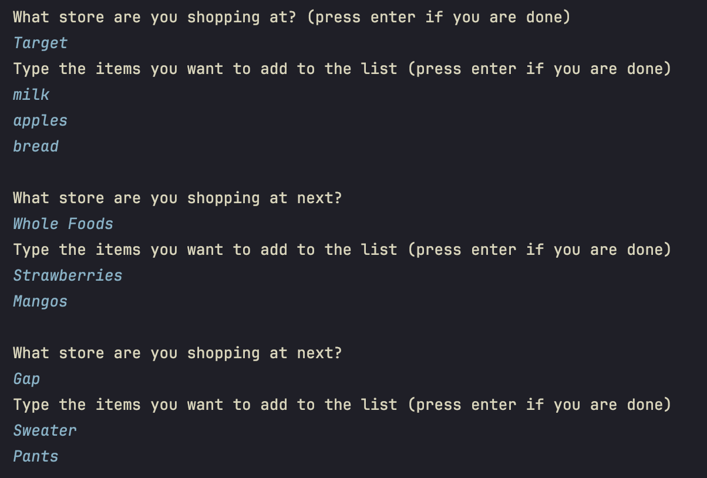
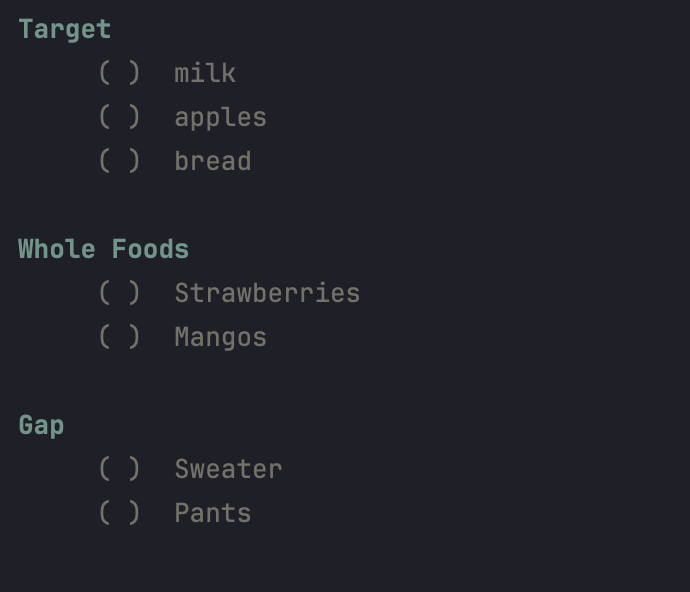

# CartHelper

A shopping list helper for shopping across multiple stores

> [!INFO]
> `Main.java` file located at [src/com/carthelper/Main.java](src/com/carthelper/Main.java)

## Example Photos

> Input

    

> Output

    

*Note: you cannot currently check off items yet*
