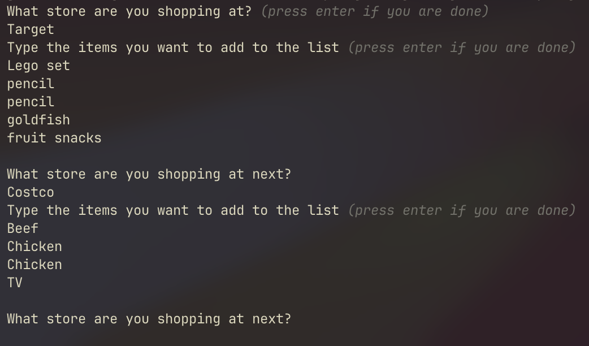
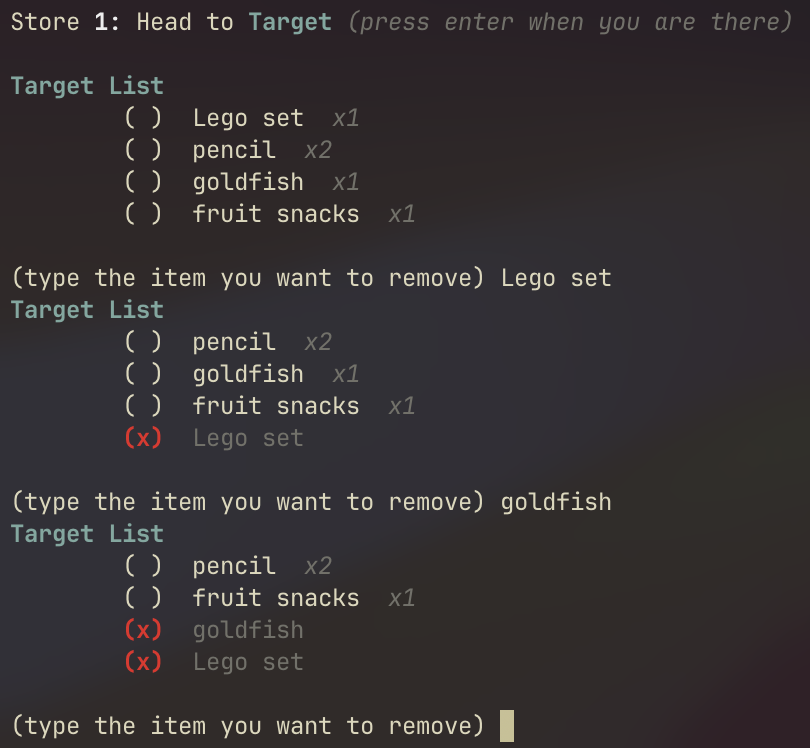
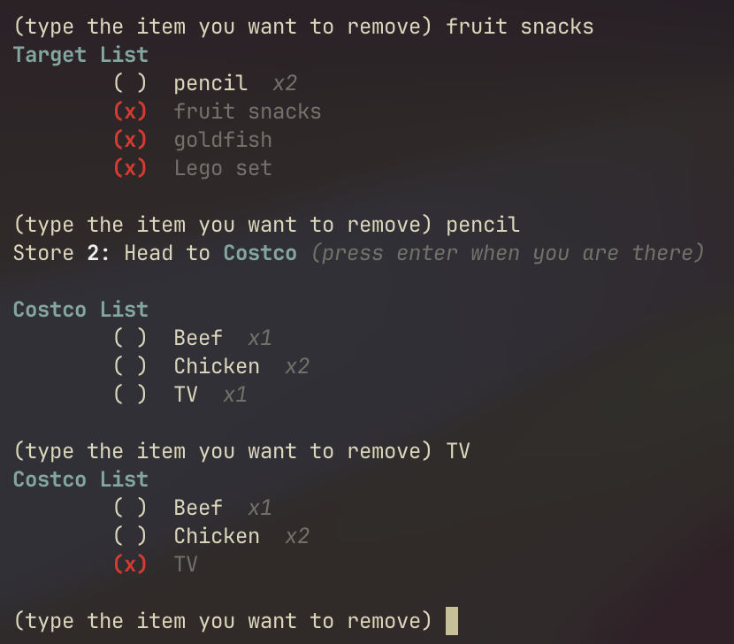

# CartHelper

A shopping list helper for shopping across multiple stores

> [!NOTE]
> `Main.java` file located at [src/com/carthelper/Main.java](src/com/carthelper/Main.java)

## How to Run

Go to the [latest release](https://github.com/ephf/CartHelper/releases) to download the `.jar` file.

You can run the program by running the `java` command in the terminal:

```shell
java -jar /path/to/carthelper.jar
```

## Example Photos

Start by inputting the stores and items you want to add, you are allowed to add multiple of the same items to each store.

<div align="center">
    
</div>

Then you can check off the items after heading to the store is says to head to,

<div align="center">
    
</div>

When you have checked off every item for one store, you can head to the next store:

<div align="center">
    
</div>